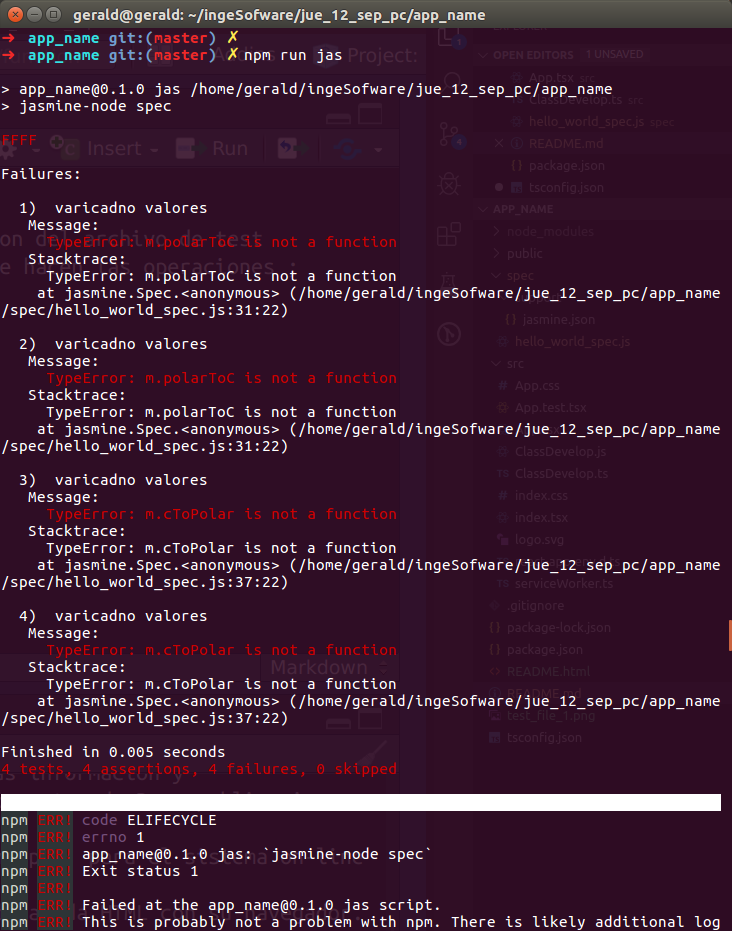
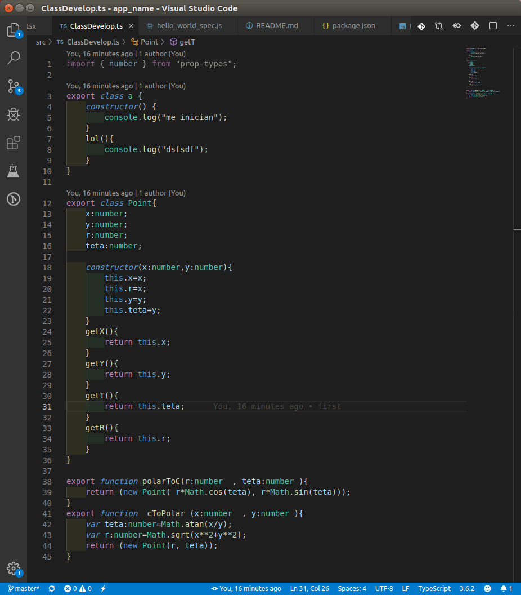

Archivos importantes 

spec/hello_world_spec.js: ubicacion del archivo de test 
src/ClassDevelop(js/ts):clases que hacen las operaciones ; 

Caputras de darsarrollo 

Inicio de los teste en rojo

corremos el test

definimos clase y funciones (verde )

salida 

